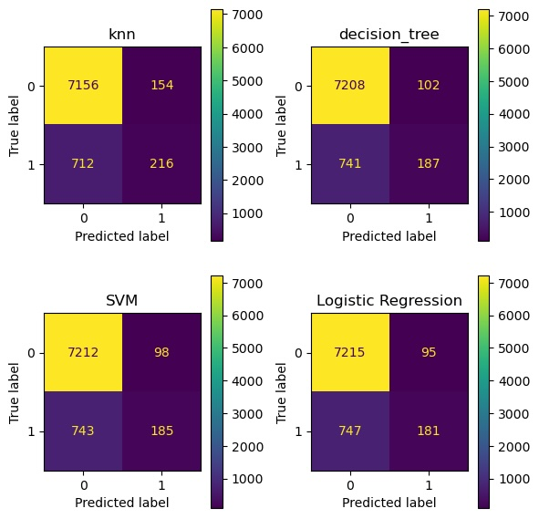

## About
This project is about how a Bank can effectively and efficiently market its products directly to its customers. In this specific case a Bank seek's to grow its assets i.e long term deposits by its customers and in return offers competitive interest rate for these deposits. 
The Bank's goal is to achieve this growth in an efficient way i.e using direct marketing which has a better succes rate over a mass campaign which typically results in less than 1% positive response. 
The bank, a Portugese bank, has collected data from its own contact center and augmented this with internal customer personal information. The target variable is captured as column 'y' which indicates 'yes' if the campaign was successful.
Given the end output is a 'yes' or 'no', this is considered as a Classification problem.

For more details on the case, please review [this PDF doc](CRISP-DM-BANK.pdf)

## Findings :
As stated above, Classification models are used with Dummy being our baseline, LogisticRegression being one other model while we focus on the 3 classification models - KNearest Neighbor (KNN), Decision Tree and Support Vector Machines(SVM)
- Our Baseline model Accuracy was 80%, which we expect the more sophisticated models to beat.
- Logistic Regression model returned an Accuracy score of 89.77%, with a duration of 4.47sec. This model was tuned to achieve best result.
- The other 3 models KNearest Neighbor (KNN), Decision Tree and Support Vector Machines (SVM), performed pretty close in terms of Accuracy Score, differing by less than 1/100th. Given how close this score was, we look at the time taken and here Decision Tree wins outright taking less than a sec while SVM took 253secs. Note that in terms of time Decision Tree also beat LogisticRegression too with Accuracy score being pretty close.

| Model | Train Time | Train Accuracy | Test Accuracy | Best Params |
|-------|------------|----------------|---------------|-------------|
| SVM	| 253.089125 | 0.897724	 | 0.897912 | SVC(coef0=1, gamma=0.1, random_state=42) |
| decision_tree	| 0.948907| 0.897481 | 0.897669 | DecisionTreeClassifier(max_depth=1, random_state=42) |
| knn	| 8.433605 | 0.902519 | 0.894877 | KNeighborsClassifier(n_neighbors=9) |

### Model Recommendation : 
Our choice of model is `Decision Tree` based on its Accuracy which is very close to the top model and the time it takes to complete the modeling. 

## Summary of Analysis :
- Data does not contain any NANs.
- Data was split using `stratify=yes` since the data (`y`) is imbalanced and we need to make sure the train and test data have equal proportion of 'yes' / 'no' values in `y` feature and hence not skewing the outcome.
### Feature Engineering : 
- Some of the features, although ideally binary, had a 3rd value 'unknown' which made it challenging to convert these columns as binary / boolean.
- `y`, the target variable was encoded using Label Encoder
- Converted categorical data into numeric using 2 approaches to understand how different Encoders influence the outcomes : 
  1. Feature `contact` was converted using Ordinal Encoder given it has 2 values. `education` was manually scored based on the # of years of education. For 'unknown' value, the average of all other values was calculated and assigned, which came to 11. For all other categorical vars, JameStein encoder was used.
  2. In the second approach `contact` was encoded using Label Encoder while all other categorical variables were encoded using Target Encoder.
- Analysis : Overall both the approaches yeilded very similar results. The one key difference observed was the stronger correlation between `education` and other independent variables in approach (1) above, over approach (2).  From an Accuracy Score perspective the difference was extremely marginal.
### Base line model : 
- DummyClassifier was used as our Baseline
### Simple model : 
- Logistic Regression was used as the simple model
### Modeling : 
- The 3 models KNN, Decision Tree and SVM were run with default params
- Above was repeated using hyper parameter tuning.

### Data Prep :
- Please see above section Feature Engineering.

## Code : 
NOTE : To run the model, please extract the data/bank-additional-full.csv.zip.
[Jupyter Notebook](bank_direct_marketing.ipynb)
