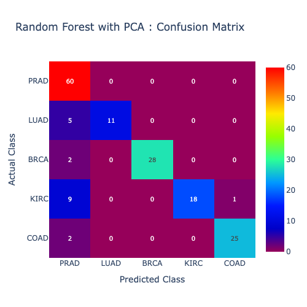

### Analysis of Gene Expressions for 5 types of Tumors

**Author**
Samba Pedapalli

#### Executive summary
Pan-Cancer analysis is a study of types of cancer and their underlying mechanisms to help diagnose patients early and develop effective treatments.

The intent of this project is to analyse gene expressions for below 5 types of tumors. In identifying these expressions, we may be able to diagnose a patient early and potentially recommend for further tests / validation.
- BRCA (Breast Cancer): Family of Genes (BRCA1 and BRCA2) are known as tumor suppresors. But mutation in these genes cause cancer.
- KIRC (Kidney Renal Clear Cell Carcinoma):
- COAD (Colon Adenocarcinoma)
- LUAD (Lung Adenocarcinoma)
- PRAD (Prostate Adenocarcinoma)

##### Findings :
The best model to help identify which potential Tumor a patient may have, based on Gene expressions, is XGBooster, with an accuracy of 91.9%. The other model tested was RandomForestClassifier. Please see [Results](!Results) section for more specific details and data points.

#### Rationale
Why should anyone care about this question?
Between 2000 and 2021, US cancer rates increased by 36.3%, per [USAFacts](https://usafacts.org/articles/how-have-cancer-rates-changed-over-time/) and this seems to be trend globally too. The economic burden is estimated to reach $25.2 trillion between 2020 and 2050, globally.
Cancer comes in different forms and at different parts of the body. A key fundamental unit of living body is Gene. Studying Gene's expressions for different types of cancers can help us diagnose different types of cancers, its progression and predict outcomes early as well as guide on the choice of therapies to use (chemo, drugs). Thus, giving the patient a higher chance of survival and reducing the overall its economic impact.

From a ML / AI perspective, this dataset has close to 20531 columns, with only 801 instances (samples). In other words, the dataset features are much larger than the number of rows and hence dataset and the the training of models need to be handled differently.

#### Research Question
The relation between tumors and Gene expressions to 5 types of cancers.

#### Data Sources
The dataset used here is from https://archive.ics.uci.edu/dataset/401/gene+expression+cancer+rna+seq, which in turn points to the original source of the dataset at https://www.synapse.org/#!Synapse:syn4301332. The gene names are dummified here, while the original names could be obtained from https://www.ncbi.nlm.nih.gov/gene, per this discussion thread https://www.synapse.org/Synapse:syn300013/discussion/threadId=5455&replyId=29619.

In the dataset used for this project, we have two files :
data.csv : A collection of 801 samples (rows), with 20531 gene expressions (columns).
labels.csv : A mapping of each record/sample to the tumor type.

#### Methodology
What methods are you using to answer the question?
We follow the standard CRISP-DM (CRoss Industry Standard Process for Data Mining) methodology :
- Understand the Business Requirement : As stated in above sections
- Understanding the data :
    - Below is the distribution of
    - Data does not have any NaNs and all the values are numerical.
    - We do have 267 features with 0 values.
    - We also realize 1660 features' have data that only falls in the 4th quartile, aka outliers.
    - Given the large number of dimensions, understanding the correlation between these features is challenging. We rely on PCA process, as noted in next step.
    - Below is the distribution of target class / labels, across the 801 records :

        | Class | Count |
        | ----- | ----- |
        | BRCA | 300 |
        | KIRC | 146 |
        | LUAD | 141 |
        | PRAD | 136 |
        | COAD | 78 |

- Prepping the data :
    - We split the data into 2 datasets - `training` and `test`. When doing so, we use the Stratify strategy, given the uneven distribution of Classes across records, as shown in above table. This helps us ensure a balanced distribution of each Class of records, across the 2 datasets.
    - We drop the features with all 0 values.
    - We also drop the features with values in 4th quartile i.e outliers that do not seem to provide much significance to the analysis, to ensure data is ready to be ingested by the PCA model. We are left with 18604 features / columns / dimensions.
    - We then reduce the number of dimensions / features to 640, using PCA.

- Modeling : Given, we are trying to identify the relationship of Gene expressions to 5 different types of tumors, we consider this to be a classification problem. We evaluate 2 Ensemble classifier models - *RandomForest* and *XGBoost*. Both the models are evaluated using below hyperparameters.

| Param / model | Random Forest Params | XGBoost Params |
| ------------- | -------------------- | -------------- |
| n_estimators      | 50, 100, 200 | 50, 100, 200 |
| max_depth         | None (until end), 10, 20 | None (default=6), 10, 20 |
| min_samples_split | 2, 1 | - |
| eta               | - | 0.2, None (0.3), 0.4 |

Hyperparam tuning is done using only 1 processor unit (n_job=1) and evaluation is based on 'Accuracy'.

- Evaluation : We evaluate the above models using various methods - accuracy score, F1 score and plot a Confusion Matrix heat map.
- Model is persisted for future usage, using [joblib](https://joblib.readthedocs.io/en/stable/) toolset

#### Results

Based on the below Accuracy (true predictions over all predictions) scores, XGBoostClassifier is the most accurate with a 91.9% accuracy. XGB model also does better in terms of other metrics as the below table shows, with precision (true +ves over predicted (true and false) +ves) of 99.39% over 90.75%, Recall of 92.55% over 88.2% and f1-score aka false alarms of 95.5% over 87.9%. The model does address our need to identify the potential tumor fo given set of gene expressions. Hence, we recommend the **XGBoost with PCA** model, which is the next most accurate model.

| Metric / Model | Random Forest | XGBoost |
| -------------- | ------------- | ------- |
| Execution Time | 0.743135 | 0.244974 |
| Accuracy | 0.881988 | 0.919255 |
| Precision | 0.907549 | 0.993891 |
| Recall | 0.881988 | 0.925466 |
| F1-Score | 0.879262 | 0.954987 |
| Best Params | max_depth : None, min_samples_split : 2, n_estimators : 100 | eta : 0.4, max_depth : None, n_estimators': 50 |
| Best Accuracy | 0.953125 | 0.948438 |

Note that although the metric 'Best Accuracy' shows Random Forest has the Best Accuracy of 95.3% over XGB's 94.8%, this measure factors in train date during hyperparam tuning, while Accuracy only factors in test data i.e unseen data. Hence we base our decision on 'Accuracy'.
XGBoost also outperforms in terms of execution time, which can be helpful if and when the dataset has large number of records.

Another interesting observation is in the feature contribution difference across the 2 models - [Random Forest with PCA feature contribution](./images/RF_Gene_Contribs_2Model1.png) vs [XGBooster with PCA feature contributions](./images/XGB_Gene_Contribs_2Model1.png). Its unclear why the case and may require further deep dive to understand the tree splits.

NOTE: All the scores are results obtained on `test` data, after the model was trained on `train` dataset.

##### Confusion Matrix Heatmap :

##### Gene expressions contribution to the model :

#### Next steps
- Modeling & Evaluation :
    -- Understand why the feature contribution varies across the 2 models by traversing through the trees and decisions therein.
    -- Evaluate XGBoost without PCA and how it performs on the complete set of dimensions
    -- Use dimension reduction techniques that preserve interpretability, such as factor analysis
    -- Use other feature selection methods (RFE, SelectKBest) instead of PCA and run the models again.
    -- Use Neural models to evaluate how they perform against the above
- Tech Debt / Refactoring :
    - Use Value Object design pattern to return values from functions, for reuse.
    - Retool functions (eg: run_pca_xxxx() ) to intake params and return values

#### Outline of project

- [Run RandomForest without PCA](./gene-exp-4-tumor-direct-rforest.ipynb)
- [Run RandomForest and XGBoost without PCA](./gene-exp-4-tumor.ipynb)
- Dataset : Is stored in the folder [TCGA-PANCAN-HiSeq-801*20531](./TCGA-PANCAN-HiSeq-801x20531/)
- [images](./images/) : Plots generated by the models are stored in this directory.
- [models](./models/) : Models used in the analysis are persisted to this directory
- This project has been created using [`uv` package tool](https://github.com/astral-sh/uv) and hence includes [requirements.txt](requirements.txt) along with [uv.lock](./uv.lock), to help setup the right env and run the file.
- data-analysis : This folder is created when the steps in the IPYNB notebooks are run. This dir is used as a place holder for analysis and hence not checked into Git.

#### Running the Application :
- Modeling : To run the Jupyter notebooks : 
    - Please download the data from https://archive.ics.uci.edu/dataset/401/gene+expression+cancer+rna+seq. This compressed file is ~70MB and hence not pushed to Git repo.
    - Follow the standard process of opening the file and executing each step in there.
- To run the Application aka with web interface, follow below steps :
    - API :
        - Open a terminal and `cd` to the directory `gene-exp-4-tumor/app`. Run the cmd `uvicorn --app-dir ./src main:app --reload --host 127.0.0.1 --port 8000` Note the URL and port are optional and these values shown here are default values.
        - Open browser and access the URL http://127.0.0.1:8000.
    - Web app :
        - Open a terminal and `cd` to the directory `gene-exp-4-tumor/ui`. Run the cmd `streamlit run src/ui.py`.
        - Above should automatically open a browser window. If not, type `http://localhost:8501/` in your browser address bar.
        - Upload a CSV file with 18604 columns of gene expressions. In `data` directory there is a test file `xgb_X_after_pca_dataset.csv` you may use.
        - Click on **Predict** button. The table output is in the order in which the records are in the input CSV file.
    - To run the tests, `cd` to the project root directory in terminal. Execute `pytest` or if print statements are needed on console type `pytest -s`.
    - To Dockerize the app :
        - Build the docker app, `docker-compose up --build`. This not only builds the app, but also runs both - backend and UI servers.
        - NOTE the server, by default, runs on port 8000 for app (backend) and 8501 for ui (frontend), and the local host(laptop) port is also set to the default ports i.e 8000 for app and 8501 for ui.

##### Contact and Further Information
Contact : samba.pedapalli@gmail.com

Pan-Cancer analysis is done by studying a large number of tumor samples to identify commonalities and differences in each cancer Genomic and Cellular alterations.

TCGA (The Cancer Genome Atlas) : An organiztion......

Gene Expression : Process by which genetic information encoded in DNA is used to create RNA molecules which in direct the production of proteins, which perform key functions within the Cell, including division, growth and other processes.
RNA-Seq : Technology that measures the expression of all genes in a sample