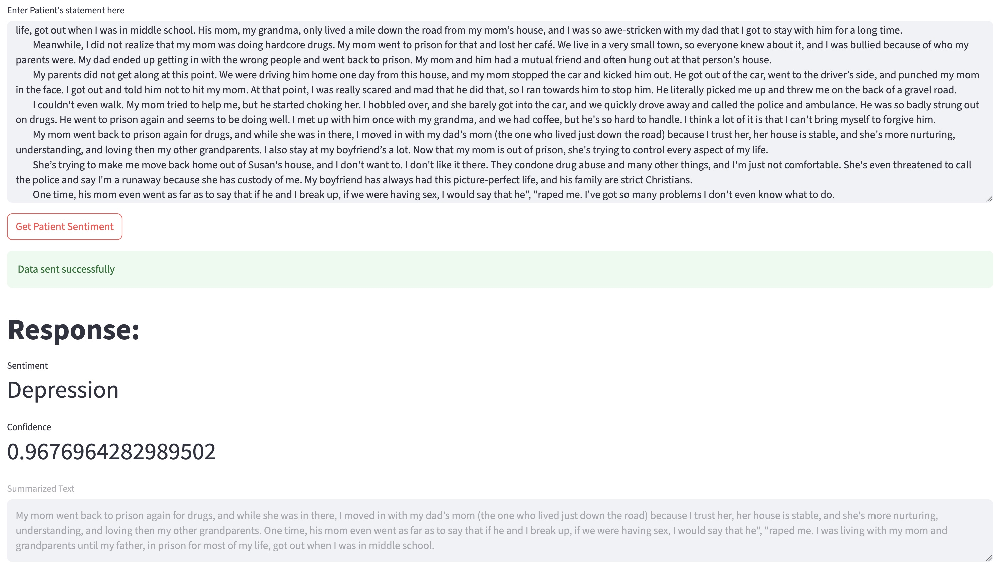
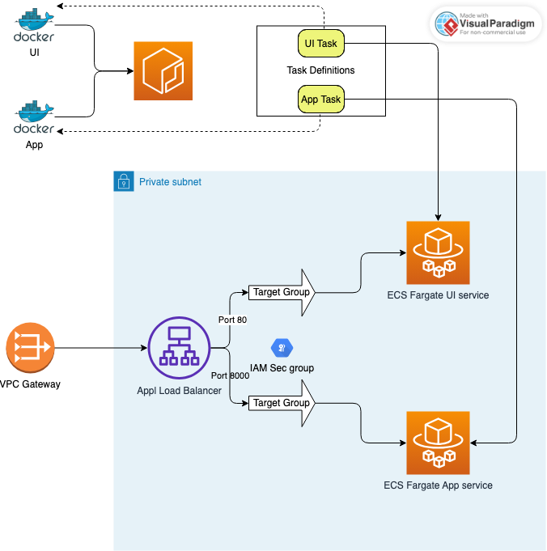

## A tool for Mental Health Counselors

### Executive summary
A tool for users to gauge a patient's feeling / sentiment based on their statement. 
User may input a patient's feeling in provided UI, and the application returns the corresponding sentiment category.
The chosen model for sentiment analysis is `sid321axn/Bio_ClinicalBERT-finetuned-medicalcondition` given it is already fined tuned on medical condition data. Based on the data used for testing this model categorizes patient's sentiment into below categories : 
- High Blood Pressure
- Depression
- Anxiety
- Pain
- Weight Loss

### Data Sources
Data used for testing the model is from Kaggle website - https://www.kaggle.com/datasets/thedevastator/nlp-mental-health-conversations/data. It contains primarily 2 fields "Context" and "Response". 

The model is input with "Context", which represents the patient's feelings, and it outputs the Sentiment category along with its confidence in the prediction.

### Methodology
1. The ask to define a category for a given text is a text classification problem, on unstructured data.
2. Identify if there is an existing pre-trained model for medical condition and the model `sid321axn/Bio_ClinicalBERT-finetuned-medicalcondition` on HuggingFace is found to satisfy this need, to begin with.
3. The data from above datasource is cleansed of NaNs and invalid values, which was one row that had 0 as its value.
4. The input to the model is the "Context" column, which is the patient's description of their feelings.
5. Given we are purely testing a pre-trained model, the necessity to split the dataset into train, test and validate seemed unnecessary.
6. Before the text is input to the model, we lemmitize the words in the text. If the number of words / tokens in the sentence is greater than 512, which is the max tokens supported by the model, we summarize the jist of patient's feelings before running it through the model.
7. The whole exercise was conducted using Jupyter notebook, initially, before putting together a python class to help achieve the objective.
8. APIs were defined and published.
9. A quick and ugly UI was put together as a user interface

### Results
The model successfully provides the sentiment of patient based on their feelings, along with the confidence score.

**NOTE**: From my testing thus far, the model largely returns -ve feelings, presuming patient is at counseling to get better.

### Next steps
1. Train the model for better results
2. Some visualization charts to that could provide a visual perspective to in and out data
3. Factor for #data-drift as part of CI : Perf metrics, monitoring and logs of model predictions, feedback loops and other aspects as laid out at https://ml-ops.org/content/mlops-principles
4. Explore other models out there that could potentially do a better job, for eg: feelings can also be positive and current model does not support positive feelings.
5. Cleanup docker images and if possible move to podman or other framework.

### Outline of project
- Project is built on Python tech stack using its `uv` package manager, `fastapi` for APIs, and `Streamlit` for UI
-  : folder contains all the backend code including APIs
-  : When the a link is provided to dowload data from the web, the data is persisted into this local folder. This folder also contains `output` folder that contains CSV files output by the model
-  : Images, largely out of the app and in future hopefully charts
-  : Contains all UI related code
-  : All Continuous deployment scripts associated to Ansible tool
-  : Config steps manually performed in AWS, especially giving the AWS user running the scripts, the necessary permissions
-  : Python scripts to achieve Continuous Deployment. This is deprecated and here more as a reference to understand AWS object relationships
- ![scripts/terraform] : Terraform related files for AWS continuous deployment
-  : Continuous deployment root scripts and other ancillary needs.
-  : Contains all the dependencies. If using `uv` this file may be used to setup the virtual environment for this project.
-  : `uv` package manager config file to track the sources, dependencies, test directory etc..
-  : Script that needs to be run to download some of the needed libraries to format / scale / summarize the text.

### Running the Application :
- Install `uv` package manager.
- Git clone the project 
- Open terminal. `cd` to the project root folder
- In terminal run `uv pip install -r requirements.txt` : This installs all dependencies listed in requirements.txt
- Run the script `app/setup.py`
- API server : 
    - Start the API server: On terminal, run the command `uvicorn --app-dir ./app api.health_conversation_model_api:app --reload --host 127.0.0.1`
    - By default the server runs on http://localhost:8000
    - To test, go to http://localhost:8000/docs, which takes you to the APIs in OpenApi format, where you can test the one API that is published currently.
    
- UI server : 
    - Start the UI server : On terminal, run the command `streamlit run ui/src/ui.py`, which starts off the server.
    - Above cmd automatically opens a web page (http://localhost:8501) in your default browser
    - Enter text in the text box on the UI page. Click on the button below it. Further below you should see the results, the patient's sentiment prediction as a label, the model's confidence on this prediction and if the text had to be modified the text, further below.

#### Dockerize (local) : 

In terminal, run the cmd

- Using Docker Compose : `docker-compose up --build | tee dockercompose.log`. This will kick off both UI and APP servers, with a network bridge between the two. The app has a docker pod name `med-counseling-app` while the UI has `med-counseling-ui`. The App server itself is given the name `counseling-app` and hence the API server is available at http://counseling-app:8000.

- Using Docker cmd aka to only build docker containers : `docker build --no-cache -f app/Dockerfile -t med-counseling-app:latest .`

- NOTE : The Python script `app/setup.py` is not required. #TODO : This diff between local and dockerize needs to be cleaned up later.

### Continuous Deployment to AWS : 

- Before running the command, make sure the AWS user you plan to use has necessary permissions aka policies assigned.
- Also NOTE that the default runtime architecture is `linux/arm64`
- Run `aws configure` to configure the user you plan to use to run below operations.
- The AWS user used for this MUST have a good set of permission policies assigned. For custom policies manually assigned, please refer to `scripts/aws_config/policies_custom.json` file. Beyond these my user was also assigned permission policies to "EC2 Container Registry", AWSEC2, AWSECS, AWSCodeDeployRoleForCloudFormation, AWSOpsWorksCloudWatchLogs, IAMReadOnlyAccess. Please assign the policies as you see the need.
- You dont need to login on the terminal using `aws ecr get-login-password ....` since the script will login using user credentials provided in above step.
- Also, as always, please activate the virtual env using `source .venv/bin/activate`. After which run the `scripts/requirements-aws.txt` script to download necessary libraries (cmd : `uv pip install -r requirements-aws.txt`).

#### Using Terraform and Ansible :  
- Ensure you have Terraform and Ansible installed.
- Ensure the scripts are executable, else run `chmod +x scripts/*.sh`
- In terminal, initialize terraform by executing `cd scripts/terraform`, followed by `terraform init`.
- Install dependencies `uv pip install scripts/requirements-ansible.txt`
- Execute `scripts/setup.sh`, which does the following : 
    - Checks pre-reqs
    - Create ECR repositories
    - Sets up dir structure
    - Optionally create S3 bucket for Terraform state (although I ran Terrform with local state. See `inventory/hosts`)
    - Update config with AWS Account ID
    - Update all vars files `vars/dev.yml`, `vars/prod.yml`, `terraform/terraform.tfvars`, 
- Execute `make deploy ENVIRONMENT=dev` to set the env to which containers will be deployed to. Alternate option is to provide env name in below cmd as shown below.
- Execute `./scripts/deploy.sh dev` (for deployment into dev environment). You can also run  alternatively before, which kicks of Ansible to choreograph below scripts and their tasks defined within : 
    - `ansible/deploy.yml` : 
        - Initializes the Environment (dev / prod) and associated variables from `ansible/vars/{environment}.yml` file.
        - Builds and pushes the Docker images by executing tasks in `ansible/tasks/build_images.yml`. Here it logs into AWS ECR and pushes the images.
        - Executes steps defined in `ansible/tasks/terraform.yml` where it initiates Terraform to build out the AWS artifacts as defined in `terraform/main.tf`. This in turn intakes `terraform/terraform.tfvars` file as input for variables.
        - Finally runs `tasks/update_services.yml` where it updates the ECS services and waits to check if services are up and running and healthy.
- The App and UI DNS names are the same. To access App directly use the port 8000
- Tech Debt : 
    - Consolidate vars to avoid duplication and in some places hardcoding
    - Different DNS names for app and ui ?

#### Using Python script in (deprecated)
- In terminal, run the command `python scripts/python/aws_deploy.py`. All the operations are currently defaulted to AWS region `us-east-1`. This command does all of the below : 
    - Creates ECR repositories, one for the backend and for the UI.
    - Create docker images of the `app` and `ui`
    - Pushes the docker images to the ECR repositories
    - Creates a VPC and subnets. If they already exist, based on naming convention used, it reuses the existing ones.
    - Creates security groups and IAM roles
    - Creates CloudWatch log groups for `app` and `ui`
    - Creates ECS cluster (name used is embedded in the code as a constant)
    - Creates Task Definitions with appropriate security groups and registry URIs. For UI also configures the backend URL as an ENV variable.
    - Creates Load Balancer with VPC and Subnet details created above. For each task/service, creates listener that routes requests to the right task's service.
    - Creates ECS service for each of the task definitions (app and ui), and provisions the same on the Cluster created above.
    - NOTE: The listener needs to be manually configured on Target Group, for now.
- NOTE : If you have previously created the images, use this command, to avoid duplication and save time : `python scripts/aws_deploy.py --app-image="<Your AWS Acct ID>.dkr.ecr.us-east-1.amazonaws.com/med-counseling-cd-app" --ui-image="<Your AWS Acct ID>.dkr.ecr.us-east-1.amazonaws.com/med-counseling-cd-ui"`. Replace the <Your AWS Acct ID> with the numeric Id that AWS gives for your account.

NOTE: Please make sure you do not have conda env or other Python package managers in your default environment PATH since if they precede the PATH before this project's virtual env, they could hijack all the commands and mess up your other environment(s).
